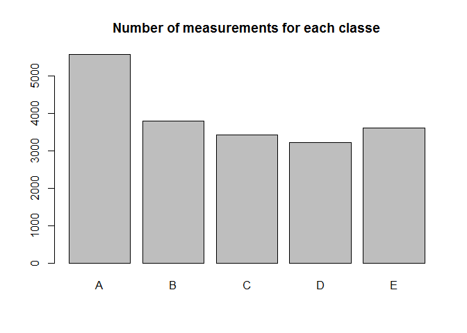

# Prediction with the Weight Lifting Excercise Dataset
K. Grimmerink  
10-12-2016  

## Overview
In the Weight Lifting Excercise Dataset, there are measurements of 6 objects performing barbell lifts. In this analysis we try to predict if the performance of these excercises are correctly or incorrectly, measured in 5 different classes.


## Loading of the data
I downloaded the data from the researcher's page. There is also a lot of extra information about the research and data. See the reference at the end of this report.

```r
FileName.train <- 'pml-training.csv'
FileName.test<-'pml-testing.csv'

# check if download files exists, if not download it
if (!file.exists(FileName.train)){
    download.file('https://d396qusza40orc.cloudfront.net/predmachlearn/pml-training.csv',FileName.train)
}
if (!file.exists(FileName.test)){
    download.file('https://d396qusza40orc.cloudfront.net/predmachlearn/pml-testing.csv',FileName.test)
}
# read file - if does not already exist
if(!exists("data.train")){
    data.train <- read.csv(FileName.train)
}
if(!exists("data.test")){
    data.test <- read.csv(FileName.test)
}
```

##Exploring the data

```r
dim(data.train)
```

```
## [1] 19622   160
```

```r
dim(data.test)
```

```
## [1]  20 160
```

```r
sum(complete.cases(data.train))
```

```
## [1] 406
```

```r
sum(complete.cases(data.test))
```

```
## [1] 0
```
We have 19622 training cases and 20 testcases.The  measurements are from 6 different persons. 
There are a lot of missing values in both the training and testset. Variables that are missing in the testset don't have value in the prediction, since I cannot test for it.Therefore I select only the variables with data in both the trainingset and the testset.

```r
data.train.sel=data.train[,c(1:11,37:49,60:68,84:86,102,113:124,140,151:160)]
data.test.sel=data.test[,c(1:11,37:49,60:68,84:86,102,113:124,140,151:160)]
```
In the testset are some factor levels missing, I have to get them equal to the trainingset, otherwise the predict function gives an error.

```r
levels(data.test.sel$cvtd_timestamp) <- levels(data.train.sel$cvtd_timestamp)
levels(data.test.sel$new_window) <- levels(data.train.sel$new_window)
```
The variable 'classe' is going to be the predictor, it says how the excersises are performed. There are 5 different classes, labeled from A to E. All of the classes have a sufficient number of measurements.

```r
barplot(table(data.train.sel$classe),main="Number of measurements for each classe")
```



##Model building
I started with a Random Forest Model to predict the manner in which the 6 subjects performed the excercises.With 10 fold cross-validation the out of sample error is estimated. All the measurements in the trainingset are assigned to a rondom selected fold.The testset is held apart. When the model is evaluated on the trainingset, an prediction is made on the 20 testsamples to perform a final test.

```r
library(randomForest)
```

```
## Warning: package 'randomForest' was built under R version 3.2.4
```

```
## randomForest 4.6-12
```

```
## Type rfNews() to see new features/changes/bug fixes.
```

```r
k=10
set.seed(1234)
fold=sample(1:10,size=nrow(data.train.sel),replace=TRUE)
err.vect=rep(NA,k)
for(i in 1:k){
    cv.train=data.train.sel[fold!=k,]
    cv.test=data.train.sel[fold==k,]
    fit=randomForest(x=cv.train[,3:59],y=as.factor(cv.train[,60]))
    prediction=predict(fit,newdata=cv.test[,3:59],type="response")
    err.vect[i]=1-sum(cv.test[,60]==prediction)/length(prediction)
        }
err.vect 
```

```
##  [1] 0.001031992 0.001031992 0.001031992 0.001031992 0.001547988
##  [6] 0.001031992 0.001547988 0.001031992 0.001547988 0.001031992
```

```r
mean(err.vect)
```

```
## [1] 0.001186791
```

Nearly all of the measurements have the right predictions, the average error is 0,1%. This is a good prediction of the out of sample error. Because of this perfect result, it is not necessary to try other models or to tune the model parameters.All the used parameters are the default.

## Final model run and error rates
As a final run the random forest with default parameters is run for the complete training set

```r
set.seed(1234)
model.rf=randomForest(x=data.train.sel[,3:59],y=as.factor(data.train.sel[,60]))
```
As we look at the predictions in the confusion matrix, we see that almost every measurement is predicted correctly. 

```r
model.rf$confusion
```

```
##      A    B    C    D    E  class.error
## A 5579    1    0    0    0 0.0001792115
## B    2 3795    0    0    0 0.0005267316
## C    0    3 3418    1    0 0.0011689071
## D    0    0    1 3213    2 0.0009328358
## E    0    0    0    1 3606 0.0002772387
```
The total error rate is nearly 0.


##Predictions on the testset
When we run the model on the testset, we get the following predictions:

```r
predict(model.rf,newdata=data.test.sel[,3:59],type="response")
```

```
##  1  2  3  4  5  6  7  8  9 10 11 12 13 14 15 16 17 18 19 20 
##  B  A  B  A  A  E  D  B  A  A  B  C  B  A  E  E  A  B  B  B 
## Levels: A B C D E
```
All these predictions are correct (tested in the Quiz)

##Conclusions
The manner in which the excercises are performed can be predicted almost perfectly with this dataset. A next step could be to test the model on different subjects to see if this results holds for other people too.

##References
Velloso, E.; Bulling, A.; Gellersen, H.; Ugulino, W.; Fuks, H. Qualitative Activity Recognition of Weight Lifting Exercises. Proceedings of 4th International Conference in Cooperation with SIGCHI (Augmented Human '13) . Stuttgart, Germany: ACM SIGCHI, 2013.

Read more: http://groupware.les.inf.puc-rio.br/har#ixzz4SRo78FOX
